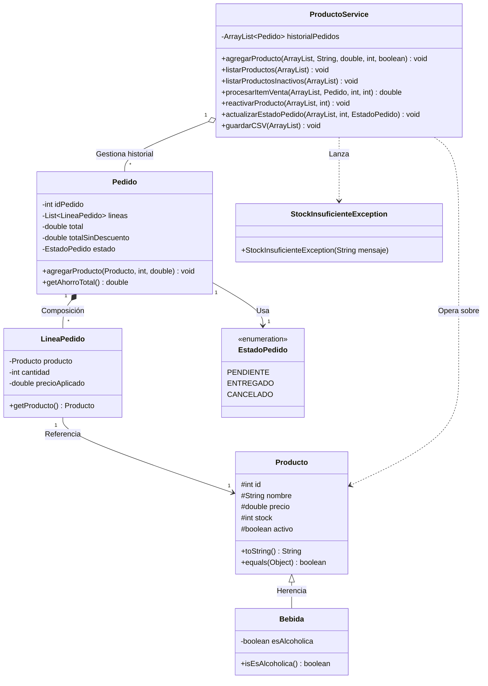

# Sistema de Gestión de Inventario y Pedidos - Pre-Entrega Java

Es una aplicación de consola desarrollada en Java 17 para gestionar un inventario de productos y procesar los pedidos de venta. Se diseño con principios de Programación Orientada a Objetos (POO) , código límpio y buenas prácticas.

## Características principales

- **Gestión de Inventario (CRUD):** Permite listar, agregar, buscar, modificar y eliminar productos.
- **Modelado con Herencia:** Implementación de clases especializadas (ej. `Bebida` que hereda de `Producto`) para manejar atributos específicos.
- **Sistema de Pedidos Detallado:** Creación de pedidos con múltiples ítems (`LineaPedido`), cálculo automático de subtotales y descuentos por cantidad.
- **Conceptos de POO Aplicados:** Uso de encapsulamiento, herencia, polimorfismo (sobrescritura de `toString` y `equals`) y sobrecarga de métodos y constructores.
- **Gestión de Estados y Stock:** Uso de `Enums` para controlar el flujo de los pedidos con orquestación automática de stock en caso de cancelaciones.
- **Persistencia de Datos:** Almacenamiento persistente en archivos CSV automatizado mediante el uso de la API `java.nio` (NIO.2).
- **Experiencia de Usuario (UX):** Interfaz de consola mejorada con validaciones de entrada, manejo de excepciones personalizadas y resaltado de errores mediante códigos de color ANSI.

## Tecnologías utilizadas

- **Lenguaje:** Java 17 (JDK 17)
- **Persistencia:** Archivos planos (CSV)

## Estructura del Proyecto

- `src/model`: Contiene las entidades de datos (`Producto`, `Bebida`, `Pedido`, `LineaPedido`, `EstadoPedido`).
- `src/service`: Lógica de negocio y manejo de archivos (`ProductoService`).
- `src/exceptions`: Excepciones personalizadas (`StockInsuficienteException`).
- `src/main`: Punto de entrada de la aplicación (`Main`).

## Ejecución

**Compilar:**
```bash
javac -d bin src/**/*.java
```

**Ejecutar:**
```bash
java -cp bin main.Main
```

## Diagrama del Sistema



## Licencia
Este proyecto está bajo la Licencia MIT. Para más detalles, consultá el archivo LICENSE.

---
Desarrollado como parte de la cursada de Java Backend 26138 como ensayo de estudio, sin fines comerciales - 2026.
