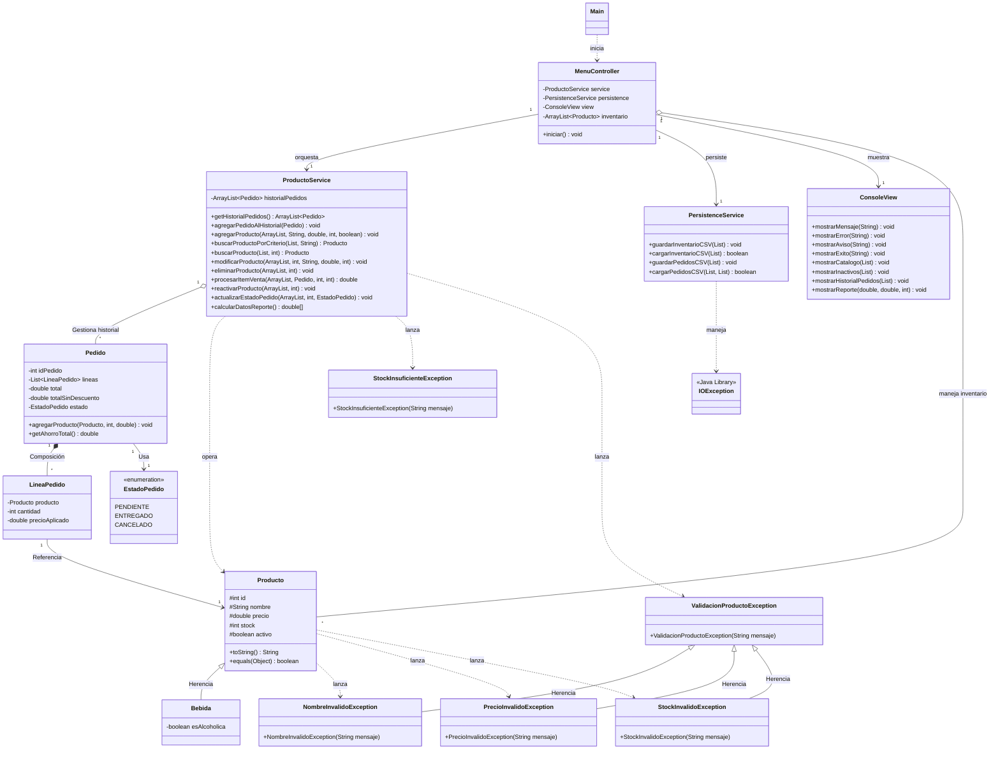

# Sistema de Gestión de Inventario y Pedidos - Pre-Entrega Java

Es una aplicación de consola desarrollada en Java 17 para gestionar un inventario de productos y procesar pedidos de venta. El sistema sigue una arquitectura modular de responsabilidad única, separando la lógica de negocio, la persistencia de datos y la interfaz de usuario.

> [!Enlace]
> [Registro de Cambios >>](changelog.md)

## Índice

- [Sistema de Gestión de Inventario y Pedidos - Pre-Entrega Java](#sistema-de-gestión-de-inventario-y-pedidos---pre-entrega-java)
  - [Índice](#índice)
  - [Características principales](#características-principales)
  - [Tecnologías utilizadas](#tecnologías-utilizadas)
  - [Estructura del Proyecto](#estructura-del-proyecto)
  - [Ejecución](#ejecución)
  - [Diagrama del Sistema](#diagrama-del-sistema)
  - [Licencia](#licencia)
  - [Talento Tech](#talento-tech)

## Características principales

**Gestión de Inventario (CRUD):** Permite listar, agregar, buscar, modificar, eliminar (desactivar) y reactivar *productos*, realizar, listar, entregar y cancelar *pedidos* y realiza un reporte de ventas mostrando el capital efectivo (*pedidos entregados*) y el crédito (*pedidos pendientes*) de las actividades realizadas. La eliminación es lógica (desactivación o "soft-delete"), permitiendo la reactivación de productos para mantener la integridad del historial de pedidos mediante la identidad de los mismos.

**Arquitectura Basada en POO:**
    - **Encapsulamiento** (validaciones en setters)
    - **Herencia** (clase `Bebida`)
    - **Polimorfismo** (sobrescritura de `toString` y `equals`)
    - **Sobrecarga** (múltiples constructores para creación y persistencia).

**Sistema de Pedidos y Lógica de Negocio:** Gestión de pedidos con múltiples líneas, cálculo automático de descuentos progresivos (10% y 20%) y orquestación de stock según el estado del pedido.

**Arquitectura Modular (SoC):** Separación de responsabilidades mediante Servicios (`ProductoService`, `PersistenceService`) y Vista (`ConsoleView`), siguiendo principios de "bajo acoplamiento".

**Control de Flujo con Enums:** Uso de `EstadoPedido` para manejar el ciclo de vida de las ventas y generar reportes de caja precisos.

**Persistencia de Datos:** Almacenamiento en archivos CSV mediante la API `java.nio`, consiguiendo que la identidad de los productos se mantenga consistente.

**Experiencia de Usuario (UX):** Interfaz de consola mejorada con validaciones de entrada, manejo de excepciones personalizadas y resaltado de errores mediante códigos de color ANSI.

## Tecnologías utilizadas

- **Lenguaje:** Java 17 (JDK 17)
- **Persistencia:** Archivos CSV (CSV Flat Files)

## Estructura del Proyecto

- `src/model`: Contiene las entidades de datos (`Producto`, `Bebida`, `Pedido`, `LineaPedido`, `EstadoPedido`).
- `src/controller`: Orquestación y control del flujo de la interfaz de usuario (`MenuController`).
- `src/service`: Lógica de negocio (`ProductoService`) y servicios de persistencia (`PersistenceService`).
- `src/view`: Manejo de la interfaz de usuario por consola (`ConsoleView`).
- `src/exceptions`: Jerarquía de excepciones personalizadas (`ValidacionProductoException`, `StockInsuficienteException`).
- `src/main`: Clase de arranque que inicializa las dependencias (`Main`).

## Ejecución

**Compilar:**
```bash
javac -d bin src/**/*.java
```

**Ejecutar:**
```bash
java -cp bin main.Main
```

## Diagrama del Sistema



## Licencia
Este proyecto está bajo la Licencia MIT. Para más detalles, consultá el archivo LICENSE.

## Talento Tech
Desarrollado como parte de la cursada de Java Backend 26138 como ensayo de estudio, sin fines comerciales - 2026.
