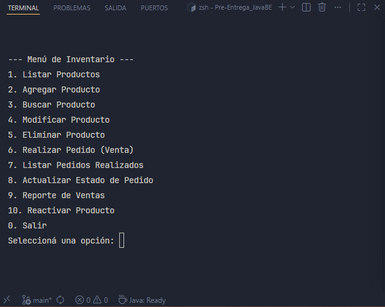
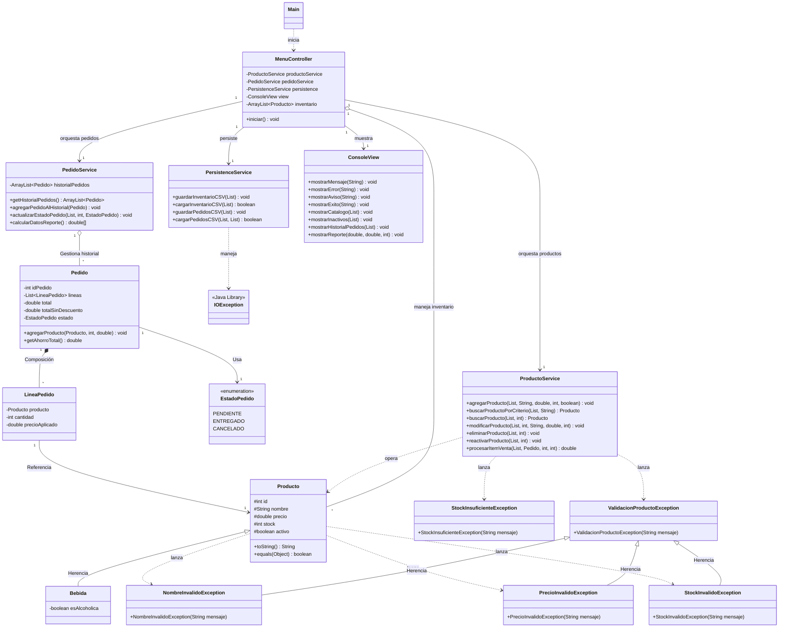

# Sistema de Gestión de Inventario y Pedidos - Pre-Entrega Java

Es una aplicación de consola desarrollada en Java 17 para gestionar un inventario de productos y procesar pedidos de venta. El sistema sigue una arquitectura modular de responsabilidad única, separando la lógica de negocio, la persistencia de datos y la interfaz de usuario.

> [Registro de Cambios >>](changelog.md)

## Índice

- [Sistema de Gestión de Inventario y Pedidos - Pre-Entrega Java](#sistema-de-gestión-de-inventario-y-pedidos---pre-entrega-java)
  - [Índice](#índice)
  - [Características principales](#características-principales)
  - [Estructura del Proyecto](#estructura-del-proyecto)
  - [Ejecución](#ejecución)
  - [Diagrama del Sistema](#diagrama-del-sistema)
  - [Licencia](#licencia)
  - [Talento Tech](#talento-tech)

## Características principales

**Gestión de Inventario (CRUD):** Permite listar, agregar, buscar, modificar, eliminar (desactivar y reactivar) *productos*, realizar, listar, entregar y cancelar *pedidos* y realiza un reporte de ventas mostrando el capital efectivo (*pedidos entregados*) y el crédito (*pedidos pendientes*) de las actividades realizadas. Se utiliza una eliminación "lógica" (desactivación booleana o "soft-delete"), que permite la reactivación de los productos, consiguiendo también con esto mantener la integridad del historial de pedidos mediante la identidad única de los productos.

<p>
  
  <br><em>Interfaz del Menú Principal (CRUD)</em>
</p>
_____________________________________


**Arquitectura Basada en POO:**

    > **Encapsulamiento** (validaciones en setters)
    > **Herencia** (clase `Bebida`)
    > **Polimorfismo** (sobrescritura de `toString` y `equals`)
    > **Sobrecarga** (múltiples constructores para creación y persistencia).


<p>
  
  <br><em>Encapsulamiento</em>
</p>
_____________________________________

<p>
  
  <br><em>Herencia</em>
</p>
_____________________________________

<p>
  
  <br><em>Polimorfismo</em>
</p>
_____________________________________

<p>
  
  <br><em>Sobrecarga de Constructores</em>
</p>
_____________________________________


**Sistema de Pedidos y Lógica de Negocio:** Gestión de pedidos con actualización de estado interactiva, cálculo automático de descuentos progresivos (10% y 20%) y recupero autonomo de stock ante cancelación.

<p>
  
  <br><em>Recupero autónomo de Stock en la cancelación de pedidos</em>
</p>
_____________________________________

**Arquitectura Modular:** Separación de responsabilidades mediante servicios especializados (`ProductoService`, `PedidoService`, `PersistenceService`), un Controlador central (`MenuController`) para la orquestación y una Vista desacoplada (`ConsoleView`). Esta estructura garantiza la responsabilidad única, facilitando el mantenimiento y la escalabilidad del sistema.

**Control de Flujo con Enums:** Uso de `EstadoPedido` para manejar el ciclo de vida de las ventas y generar reportes de caja.

<p>
  
  <br><em>Entidad que implementa el enum</em>
</p>

<p>
  
  <br><em>Aplicación de enums en el sistema</em>
</p>

**Persistencia de Datos:** Almacenamiento en archivos CSV mediante la API `java.nio`, consiguiendo que la identidad de los productos se mantenga consistente.

<p>
  
  <br><em>Parte de la implementación de persistencia en el sistema</em>
</p>

**Experiencia de Usuario (UX):** Interfaz de consola mejorada con validaciones de entrada, manejo de excepciones personalizadas y resaltado de errores mediante códigos de color ANSI.

<p>
  
  <br><em>Excepción personalizada para la entrada de nombres de productos implementada mediante el principio de Herencia</em>
</p>

<p>
  
  <br><em>Ejemplo de uso de validación, en este caso, usando polimorfismo en la jerarquia de excepciones de dominio, basada en Runtime Exception, implementada en el sistema</em>
</p>


## Estructura del Proyecto

```text
/Pre-Entrega_JavaBE"
|
|___ "/bin"   # (innecesario para el contexto)
|
|___ "/src"
	|
	|___ "/assets"
	|	|
	|	|"herencia1.png"
	|	|"logicaPedidos.png"
	|	|"menuCRUD.png"
	|	|"polimorfismo.png"
	|	|"sobrecargaConstructor.png"
	|	|"validacionSetter.png"
	|
	|___ "/controller"
	|	|
	|	|"MenuController.java"
	|
	|___ "/exceptions"
	|	|
	|	|"NombreInvalidoException.java"
	|	|"PrecioInvalidoException.java"
	|	|"StockInsuficienteException.java"
	|	|"StockInvalidoException.java"
	|	|"ValidacionProductoException.java"
	|
	|___ "/main"
	|	|
	|	|"Main.java"
	|
	|___ "/model"
	|	|
	|	|"Bebida.java"
	|	|"EstadoPedido.java"
	|	|"LineaPedido.java"
	|	|"Pedido.java"
	|	|"Producto.java"
	|
	|___ "/service"
	|	|
	|	|"PedidoService.java"
	|	|"PersistenceService.java"
	|	|"ProductoService.java"
	|
	|___ "/view"
	|	|
	|	|"ConsoleView.java"
	|
	|___".gitignore"
		"changelog.md"
		"inventario.csv"
		"LICENSE"
		"pedidos.csv"
		"pedidos_detalle.csv"
		"README.md"
```

## Ejecución

Desde el directorio raíz en el que se instaló el sistema:

**Compilar:**
```bash
javac -d bin src/**/*.java
```

**Ejecutar:**
```bash
java -cp bin main.Main
```

## Diagrama del Sistema



## Licencia
Este proyecto está bajo la Licencia MIT. Para más detalles, consultá el archivo LICENSE.

## Talento Tech
Desarrollado como parte de la cursada de Java Backend 26138 como ensayo de estudio, sin fines comerciales - 2026.
