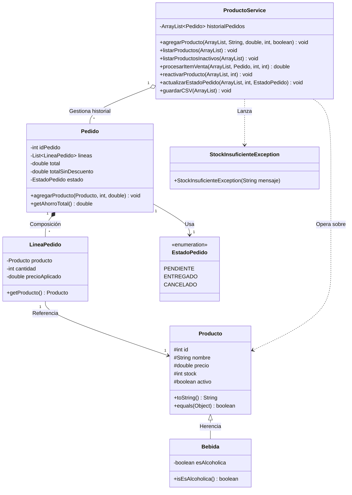

```mermaid
classDiagram
    class Producto {
        #int id
        #String nombre
        #double precio
        #int stock
        #boolean activo
        +toString() String
        +equals(Object) boolean
    }

    class Bebida {
        -boolean esAlcoholica
        +isEsAlcoholica() boolean
    }

    class Pedido {
        -int idPedido
        -List~LineaPedido~ lineas
        -double total
        -double totalSinDescuento
        -EstadoPedido estado
        +agregarProducto(Producto, int, double) void
        +getAhorroTotal() double
    }

    class LineaPedido {
        -Producto producto
        -int cantidad
        -double precioAplicado
        +getProducto() Producto
    }

    class EstadoPedido {
        <<enumeration>>
        PENDIENTE
        ENTREGADO
        CANCELADO
    }

    class ProductoService {
        -ArrayList~Pedido~ historialPedidos
        +agregarProducto(ArrayList, String, double, int, boolean) void
        +listarProductos(ArrayList) void
        +listarProductosInactivos(ArrayList) void
        +procesarItemVenta(ArrayList, Pedido, int, int) double
        +reactivarProducto(ArrayList, int) void
        +actualizarEstadoPedido(ArrayList, int, EstadoPedido) void
        +guardarCSV(ArrayList) void
    }

    class StockInsuficienteException {
        +StockInsuficienteException(String mensaje)
    }

    Producto <|-- Bebida : Herencia
    Pedido "1" *-- "*" LineaPedido : Composición
    LineaPedido "1" --> "1" Producto : Referencia
    Pedido "1" --> "1" EstadoPedido : Usa
    ProductoService "1" o-- "*" Pedido : Gestiona historial
    ProductoService ..> Producto : Opera sobre
    ProductoService ..> StockInsuficienteException : Lanza
```
